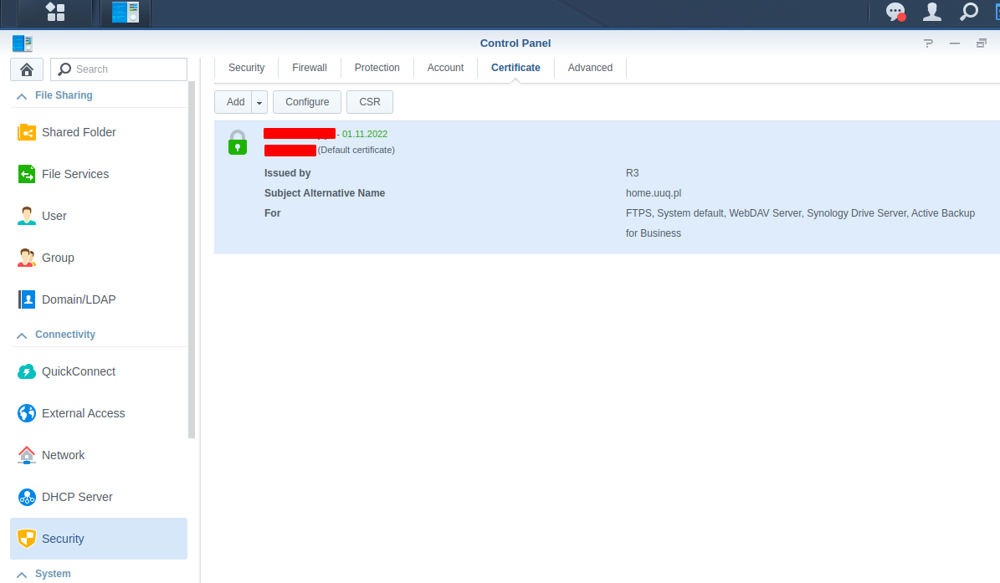
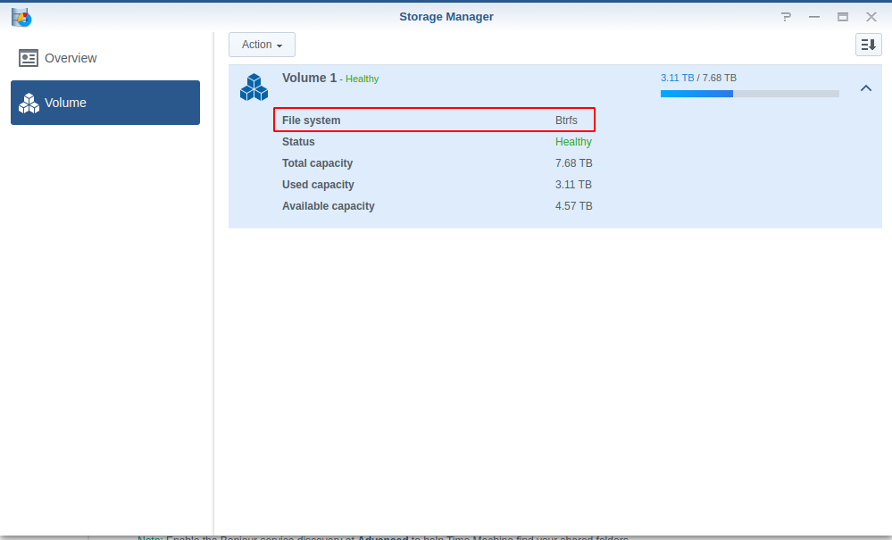
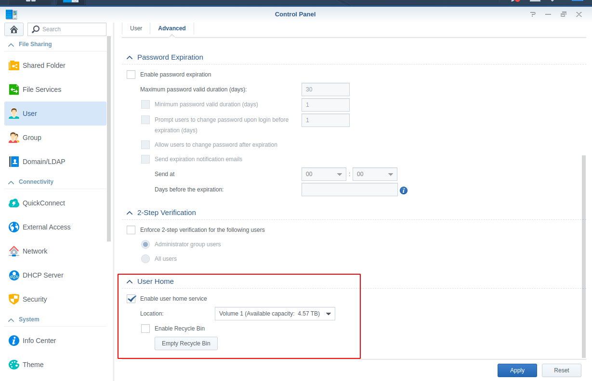
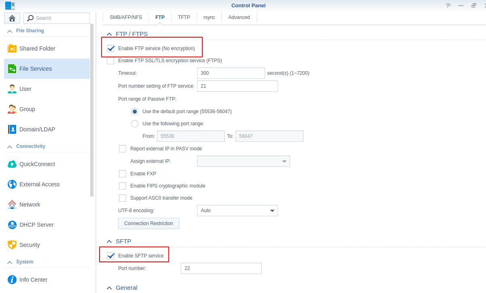
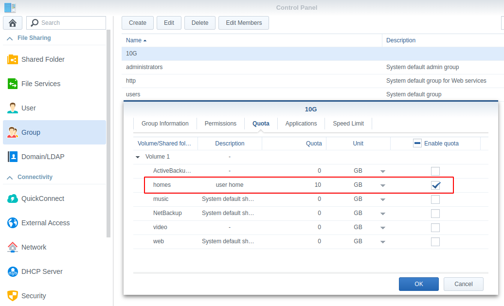
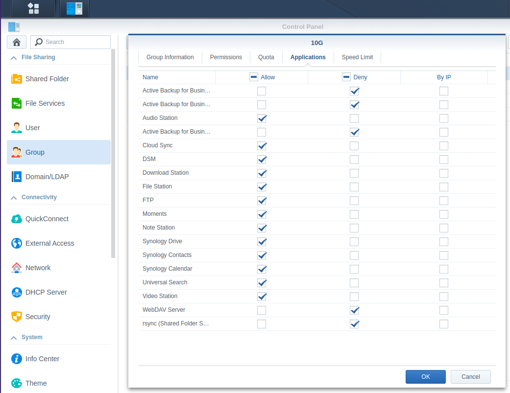

# Synology part setup guide

### Synology module **[WHMCS](https://puqcloud.com/link.php?id=77)** 

#####  [Order now](https://puqcloud.com/whmcs-module-synology.php) | [Download](https://download.puqcloud.com/WHMCS/servers/PUQ_WHMCS-Synology/) | [Community](https://community.puqcloud.com/)

Here are the initial steps of configuring Synology devices to prepare them for use with the WHMCS module.

> **Note:** At the beginning, you should prepare the appropriate domain with the correct DNS entries so that you can generate a correct SSL certificate for Your Synology NAS server. 

##### 1. Generate an SSL certificate for your domain.

Connect the certificate for all services that will be used in the server.(FTPS, System, Synology Drive, etc...)

##### 2. Make sure the partition is formatted in BTRFS

##### 3. Enable the user's home folder.

##### 4. Enable all necessary file services (ie: FTP, FTPS, SFTP, etc.).

##### 5. Create user groups with the necessary quotas and permissions.

