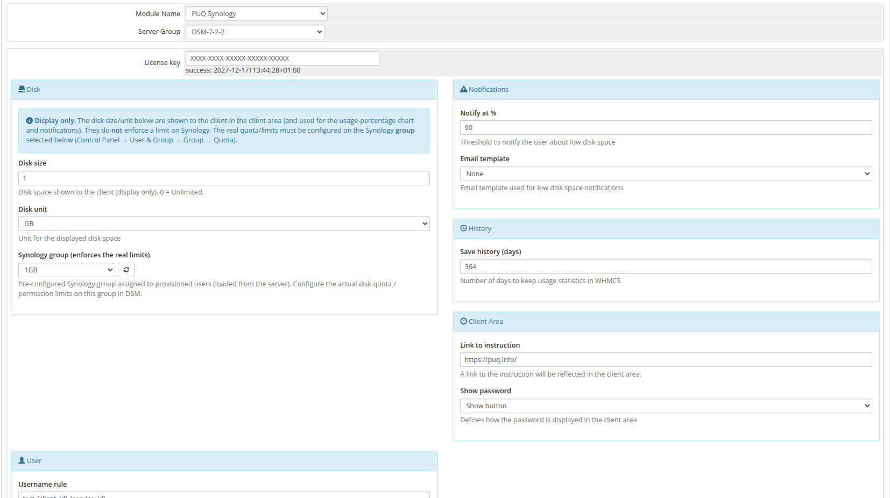

# WHMCS part setup guide

### Synology module **[WHMCS](https://puqcloud.com/link.php?id=77)**
#####  [Order now](https://puqcloud.com/whmcs-module-synology.php) | [Download](https://download.puqcloud.com/WHMCS/servers/PUQ_WHMCS-Synology/) | [Community](https://community.puqcloud.com/)

##### 1. Download the latest version of the module

Choose the build that matches your server's PHP version:

PHP 8.2
```bash
wget https://download.puqcloud.com/WHMCS/servers/PUQ_WHMCS-Synology/php82/PUQ_WHMCS-Synology-latest.zip
```

PHP 8.1
```bash
wget https://download.puqcloud.com/WHMCS/servers/PUQ_WHMCS-Synology/php81/PUQ_WHMCS-Synology-latest.zip
```

PHP 7.4
```bash
wget https://download.puqcloud.com/WHMCS/servers/PUQ_WHMCS-Synology/php74/PUQ_WHMCS-Synology-latest.zip
```

> **Note:** All versions are available here: [https://download.puqcloud.com/WHMCS/servers/PUQ_WHMCS-Synology/](https://download.puqcloud.com/WHMCS/servers/PUQ_WHMCS-Synology/)

##### 2. Unzip the archive with the module

```bash
unzip PUQ_WHMCS-Synology-latest.zip
```

##### 3. Copy "puqSynology" to "WHMCS_WEB_DIR/modules/servers/"

##### 4. Add the Synology NAS server in WHMCS

```
System Settings -> Servers -> Add New Server
```

- Enter the correct **Name** and **Hostname**


- In the **Server Details** section, select the **PUQ Synology** module and enter the correct **username** and **password** of the **Synology DSM** account.
- Click **Test connection** to verify.


> **Warning:** The **ACCESS HASH** field is used to store the server access key and is updated automatically — do not edit it manually.

For more details, see **[Add server (Synology NAS)](05-add-server.md)**.

##### 5. Create the product

```
System Settings -> Products/Services -> Create a New Product
```

In the **Module Settings** section, select the **PUQ Synology** module and the **Server Group** that contains your Synology server, then click **Save Changes** to load the configuration panel.



Every setting in this panel (License key, Disk, Synology group, Notifications, History, Client Area and User rules) is described in detail on the **[Product Configuration](06-product-configuration.md)** page.
