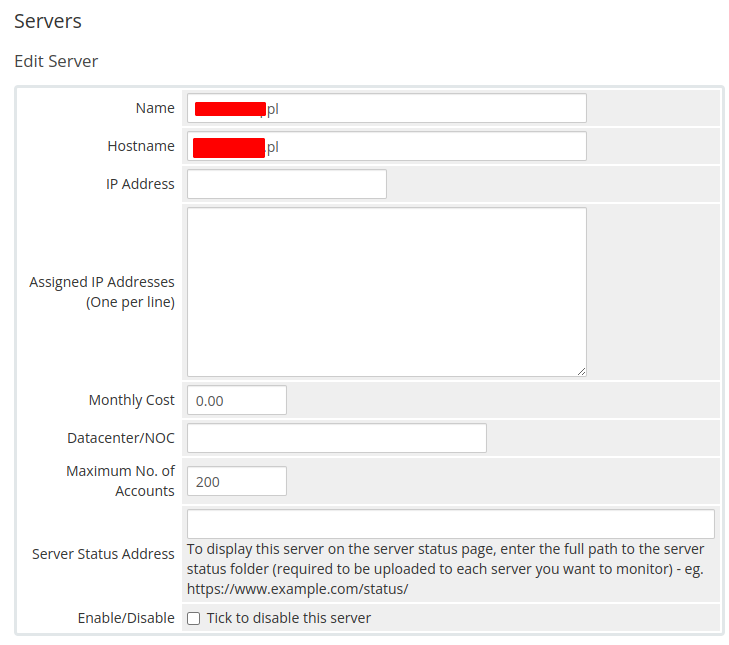
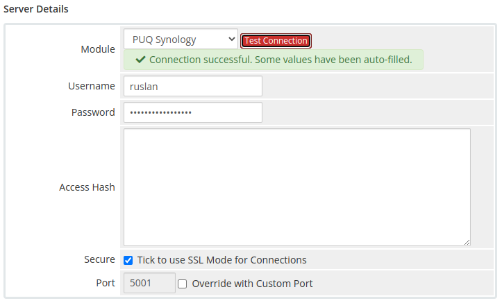
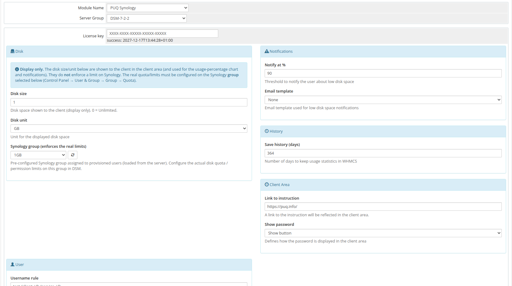

# Setup guide: WHMCS setup

### Synology module **[WHMCS](https://puqcloud.com/link.php?id=77)**
#####  [Order now](https://puqcloud.com/whmcs-module-synology.php) | [Download](https://download.puqcloud.com/WHMCS/servers/PUQ_WHMCS-Synology/) | [Community](https://community.puqcloud.com/)

---

## Step 1: Add server in WHMCS

Navigate to:
```
System Settings -> Servers -> Add New Server
```

1. Enter the correct **Name** and **Hostname**


*10-add-server-1.png*

2. In the **Server Details** section, select the **PUQ Synology** module and enter the correct **username** and **password** of the **Synology DSM** account.
3. Click **Test connection** to verify.


*11-add-server-2.png*

> **Warning:** The **ACCESS HASH** field is used to store the server access key and is updated automatically — do not edit it manually.

For more details, see **[Add server (Synology NAS)](05-add-server.md)**.

---

## Step 2: Create product in WHMCS

Navigate to:
```
System Settings -> Products/Services -> Create a New Product
```

In the **Module Settings** section, select the **PUQ Synology** module and the **Server Group** that contains your Synology server, then click **Save Changes** to load the configuration panel.


*14-product-configuration-overview.png*

Every setting in this panel (License key, Disk, Synology group, Notifications, History, Client Area and User rules) is described in detail on the **[Product Configuration](06-product-configuration.md)** page.
