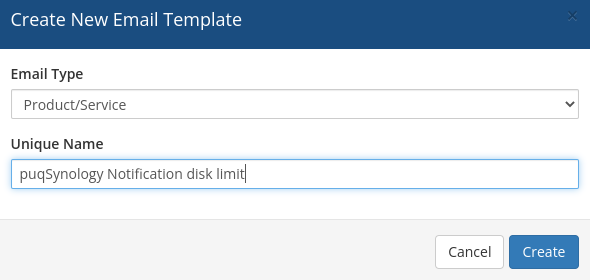
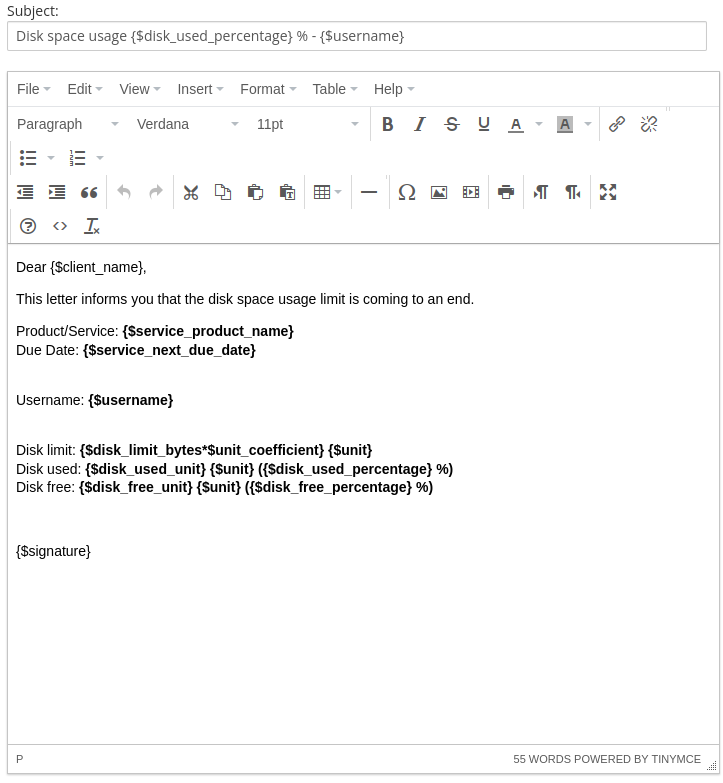

# Email Template (puqSynology Notification disk limit)

### Synology module **[WHMCS](https://puqcloud.com/link.php?id=77)** 

#####  [Order now](https://puqcloud.com/whmcs-module-synology.php) | [Download](https://download.puqcloud.com/WHMCS/servers/PUQ_WHMCS-Synology/) | [Community](https://community.puqcloud.com/)

##### Create an email template for customer notifications.

```
System Settings->Email Templates->Create New Email Template
```

- **Email Type:** Product/service
- **Unique Name:** puqSynology Notification disk limit



**Subject:**

```PHP
Disk space usage {$disk_used_percentage} % - {$username}
```

**Body:**

```PHP
Dear {$client_name},

This letter informs you that the disk space usage limit is coming to an end.

Product/Service: {$service_product_name}
Due Date: {$service_next_due_date}

Username: {$username}

Disk limit: {$disk_limit_bytes*$unit_coefficient} {$unit}
Disk used: {$disk_used_unit} {$unit} ({$disk_used_percentage} %)
Disk free: {$disk_free_unit} {$unit} ({$disk_free_percentage} %)

{$signature}
```

