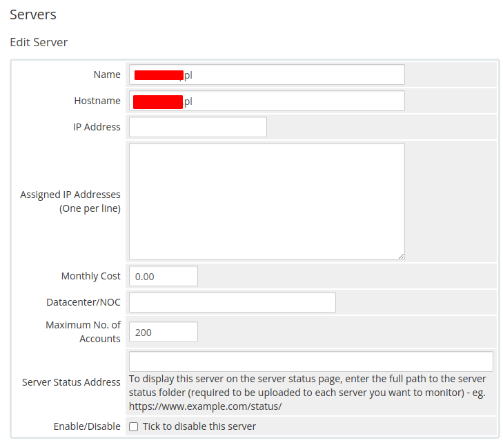
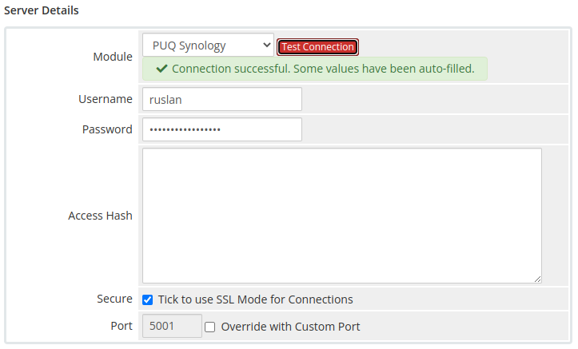

# Add server (Synology NAS)

### Synology module **[WHMCS](https://puqcloud.com/link.php?id=77)** 

#####  [Order now](https://puqcloud.com/whmcs-module-synology.php) | [Download](https://download.puqcloud.com/WHMCS/servers/PUQ_WHMCS-Synology/) | [Community](https://community.puqcloud.com/)

##### Add a new server to the system WHMCS.

```
System Settings->Servers->Add New Server
```

- Enter the correct **Name** and **Hostname**



- In the **Server Details** section, select the "**PUQ Synology**" module and enter the correct **username** and **password** for the **Synology NAS web interface**.
- To check, click the **"Test connection"** button



> **Warning:** WARNING: **ACCESS HASH** field Used to store the access key to the server and is updated automatically.