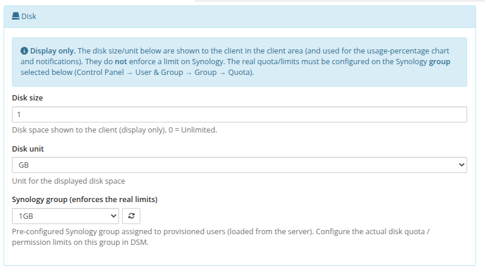
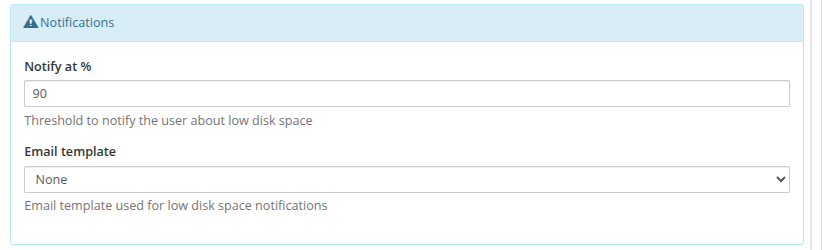
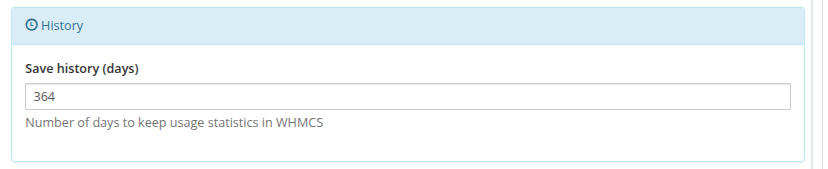
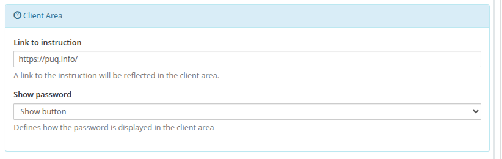
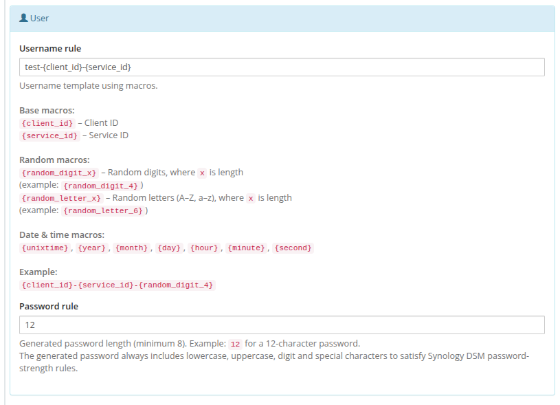

# Product Configuration

### Synology module **[WHMCS](https://puqcloud.com/link.php?id=77)**
#####  [Order now](https://puqcloud.com/whmcs-module-synology.php) | [Download](https://download.puqcloud.com/WHMCS/servers/PUQ_WHMCS-Synology/) | [Community](https://community.puqcloud.com/)

##### Add a new product to WHMCS

```
System Settings -> Products/Services -> Create a New Product
```

In the **Module Settings** section, select the **PUQ Synology** module and the **Server Group** that
contains your Synology server, then click **Save Changes**. The module then renders its modern
configuration panel.


> **Note:** Select the **Server Group** and save the product first — the **Synology group** drop-down
> (in the Disk section) is populated live from the server assigned to that group.

At the top of the panel:

- **Module Name** — the provisioning module (**PUQ Synology**).
- **Server Group** — the WHMCS server group whose Synology server this product is provisioned on.
- **License key** — your pre-purchased **PUQ Synology** license key. The validation status and the
  paid-through date are shown right below the field; the key must be **active** for the module to work.

---

### Disk



> **Note:** **Display only.** The disk size/unit are shown to the client in the client area (and used for
> the usage-percentage chart and notifications). They do **not** enforce a limit on Synology. The real
> quota/permission limits must be configured on the **Synology group** selected here
> (Control Panel → User & Group → Group → Quota).

- **Disk size** — disk space shown to the client (display only). `0` = Unlimited.
- **Disk unit** — unit (MB / GB / TB) for the displayed disk space.
- **Synology group (enforces the real limits)** — the pre-configured Synology group assigned to
  provisioned users, chosen from a live drop-down of the groups that actually exist on the server.
  Use the refresh button to reload the list. Configure the real disk quota / permissions on this group in DSM.

---

### Notifications



- **Notify at %** — usage threshold; when a client exceeds it, a low-disk-space notification is sent.
- **Email template** — the WHMCS email template used for low-disk-space notifications (`None` to disable).

---

### History



- **Save history (days)** — how many days of disk-usage statistics to keep in WHMCS.

---

### Client Area



- **Link to instruction** — an optional URL; when set, a **User manual** button is shown in the client area.
- **Show password** — how the password is presented in the client area (**Show button** / plain text / hidden).

---

### User



- **Username rule** — template for the generated username, using macros:
  - Base: `{client_id}`, `{service_id}`
  - Random: `{random_digit_x}`, `{random_letter_x}` (where *x* is the length, e.g. `{random_digit_4}`)
  - Date & time: `{unixtime}`, `{year}`, `{month}`, `{day}`, `{hour}`, `{minute}`, `{second}`
  - Example: `{client_id}-{service_id}-{random_digit_4}`
  - The generated name is automatically normalised to be Synology/DSM compliant, and collisions with other
    services are resolved automatically.
- **Password rule** — generated password length (minimum 8), e.g. `12`. The generated password always
  includes lowercase, uppercase, digit and special characters to satisfy the Synology DSM
  password-strength rules.
