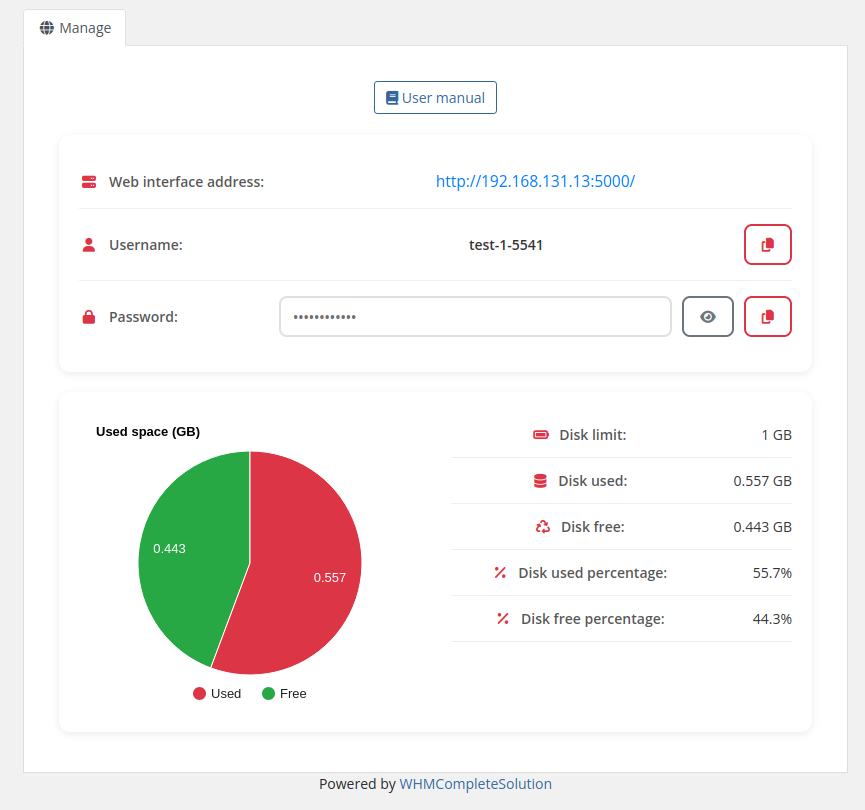

# Home screen

### Synology module **[WHMCS](https://puqcloud.com/link.php?id=77)** 

#####  [Order now](https://puqcloud.com/whmcs-module-synology.php) | [Download](https://download.puqcloud.com/WHMCS/servers/PUQ_WHMCS-Synology/) | [Community](https://community.puqcloud.com/)

The end customer, after logging in to his own customer panel, has access to the following information and options

- Link to the user manual (*which was defined by the administrator when setting up the service.*).
- Synology server adress
- Authorization data
- Usage statistics graph
- Table with data on the use of the service

