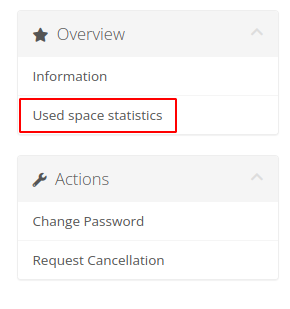
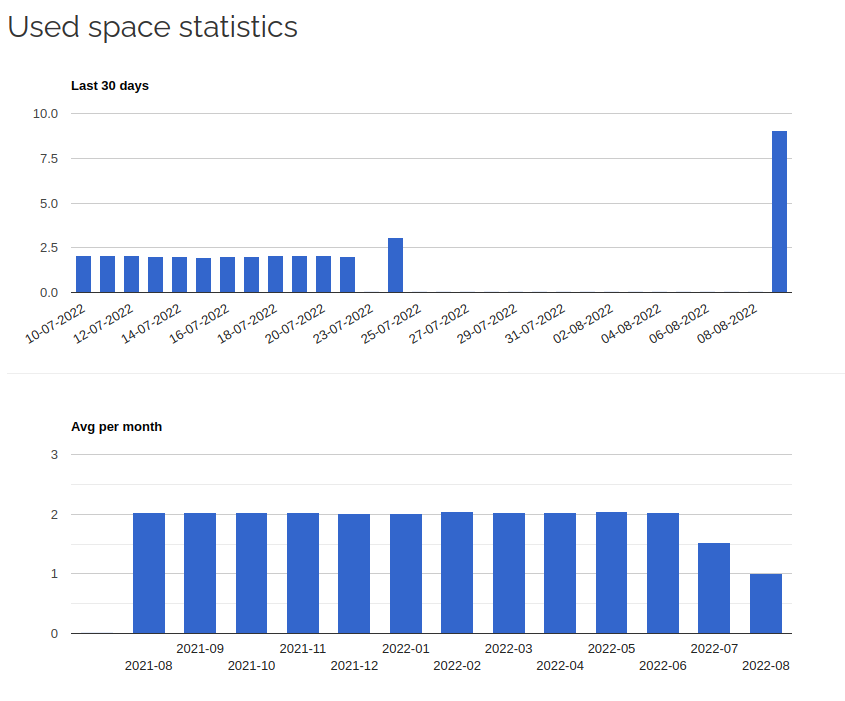

# Disk statistics

### Synology module **[WHMCS](https://puqcloud.com/link.php?id=77)** 

#####  [Order now](https://puqcloud.com/whmcs-module-synology.php) | [Download](https://download.puqcloud.com/WHMCS/servers/PUQ_WHMCS-Synology/) | [Community](https://community.puqcloud.com/)

Client can check the data usage statistics in the menu item **"Used space statistics"**

##### Disk Usage Charts

