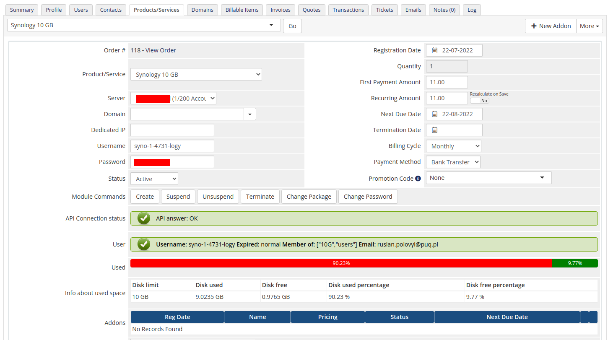

# Description

### Synology module **[WHMCS](https://puqcloud.com/link.php?id=77)**
#####  [Order now](https://puqcloud.com/whmcs-module-synology.php) | [Download](https://download.puqcloud.com/WHMCS/servers/PUQ_WHMCS-Synology/) | [Community](https://community.puqcloud.com/)

The **PUQ Synology module for WHMCS** turns your Synology NAS into a fully automated, self-service storage product. From the moment a client places an order, the module creates and manages their Synology DSM account end-to-end — no manual steps, no DSM logins, no spreadsheets. Everything is handled through the official Synology DSM Web API.

Built for resellers and hosting providers, the module lets you sell disk space on Synology devices with per-plan parameters defined by **Synology groups**, while your clients get a clean, modern self-service area.

> **Note:** The module requires an existing, fully deployed Synology machine with properly configured groups and other options (more information later in the manual).

> **Note:** The module does not install or configure DSM on Synology machines in any way — it only provisions and manages user accounts through the API.

---

## Key features

### Full account lifecycle automation
- Automatic account **creation and deployment** on Synology when an order is activated
- **Suspend, unsuspend, terminate, change password** and **change package** — all driven by the DSM API
- **Duplicate protection** — the module never overwrites an account that already exists on the NAS
- Smart, collision-safe **username generation** with macros (`{client_id}`, `{service_id}`, random digits/letters, date/time) — always DSM/Linux-compliant
- **DSM-policy-aware password generation** — generated passwords automatically satisfy your server's password-strength rules

### Group-based plans (real limits on the server)
- Each product assigns the client to a **pre-configured Synology group**, chosen from a live drop-down of the groups that actually exist on your server
- The real disk quota and permissions are enforced by that Synology group — configure them once in DSM and resell with confidence
- On **package change**, the user is moved from the old group to the new one automatically

### Disk usage monitoring & notifications
- Live **disk usage** with current and historical data (last 30 days and monthly averages)
- Automatic **email notification** when a client exceeds a configurable usage threshold
- Usage percentage and free/used breakdown shown to the client

### Modern client area
- Redesigned, card-based interface with **copy-to-clipboard** for credentials and a **show/hide password** toggle
- Disk-usage **pie chart** and historical **usage statistics** charts
- One-click link to your **user manual / setup instructions**

### Powerful admin tools
- **API connection status** indicator
- **User details** at a glance — username, status, group membership, email, expiry
- **Disk usage** progress bar and full breakdown directly on the service page
- Built-in **license verification** with proactive alerts on the admin dashboard

### Localization & compatibility
- **25 interface languages** out of the box
- Works across the **entire Synology DSM 7 line**
- Compatible with **WHMCS 8+** and **PHP 7.4 / 8.1 / 8.2** (PHP-version-specific builds provided)

---

## Compatibility

| Requirement | Supported |
|-------------|-----------|
| **Synology DSM** | Entire DSM 7.x line |
| **WHMCS** | 8.x or higher |
| **PHP** | 7.4 / 8.1 / 8.2 |
| **ionCube Loader** | Required |

---

## Screenshots

### Client area — modern self-service

### Admin area — product information

